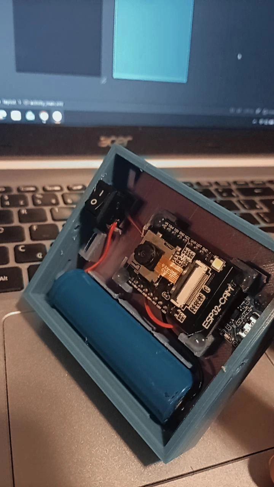
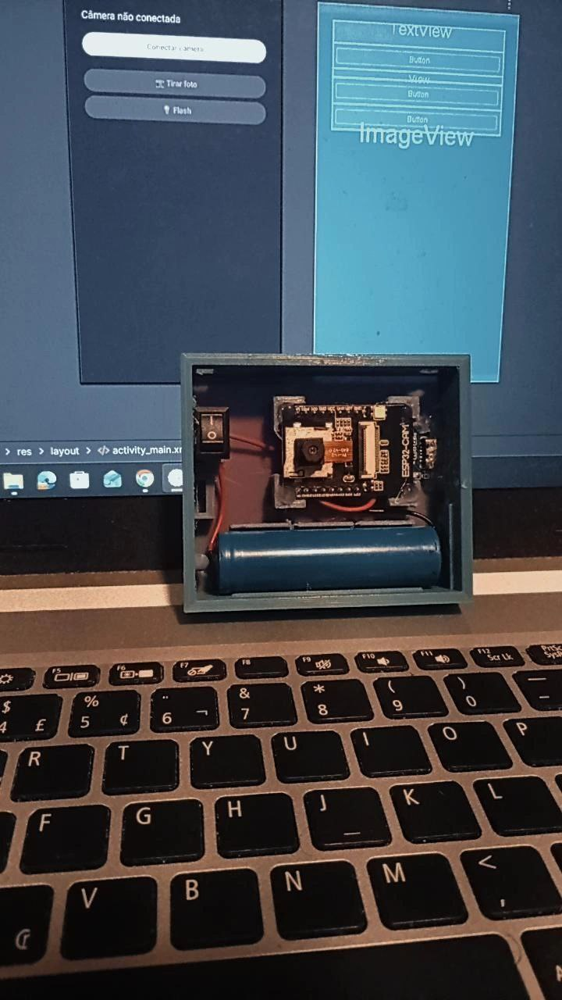
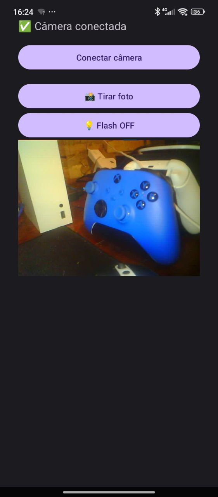

# 📷 PocketPointCam

PocketPointCam é um projeto **IoT + Mobile** que transforma um **ESP32-CAM** em uma câmera portátil controlada por um aplicativo **Android**. O app se conecta diretamente ao ponto de acesso (AP) criado pelo ESP32-CAM e permite **verificar a câmera, tirar fotos e ligar/desligar o flash**, tudo de forma simples e offline.


### ESP32-CAM
<p align="center">
  
  
</p>

### Aplicativo Android
<p align="center">
  
</p>

---

## 🚀 Visão Geral

- 📡 ESP32-CAM cria um **Wi‑Fi AP próprio**
- 📱 Aplicativo Android se conecta manualmente ao Wi‑Fi da câmera
- 🔍 App verifica a câmera via endpoint `/status`
- 📸 Foto capturada via `/photo`
- 💡 Flash controlado via `/flash/on` ou `/flash/off`
- ❌ Sem cloud, sem internet, sem permissões invasivas

---


## 🧩 Arquitetura

```
[ Android App ]  --->  HTTP  --->  [ ESP32-CAM ]
       |                          |- /status
       |                          |- /photo
       |                          |- /flash
       |
   Wi-Fi AP (PocketPointCam_AP)
```


## 📦 Tecnologias Utilizadas

### ESP32-CAM
- Arduino Framework
- WebServer (HTTP)
- esp_camera

### Android
- Kotlin
- Android Studio
- HTTPUrlConnection
- AlertDialog

---

## 📡 Configuração do Wi‑Fi da Câmera

O ESP32-CAM cria automaticamente o seguinte ponto de acesso:

- **SSID:** `PocketPointCam_AP`
- **Senha:** `*PocketPointCam@2026`
- **IP:** `192.168.4.1`

O aplicativo **não manipula o Wi‑Fi do Android**. O usuário conecta manualmente e o app apenas testa a comunicação.

---

## 🔗 Endpoints do ESP32-CAM

### ✅ Status
```
GET /status
```
Retorno esperado:
```json
{"status":"ok"}
```

---

### 📸 Capturar Foto
```
GET /photo
```
Retorna uma imagem JPEG capturada pela câmera.

---

### 💡 Flash ON / OFF
```
GET /flash/on   // liga
GET /flash/off  // desliga
```

---

## 📱 Funcionalidades do App Android

- 🔘 Botão **Conectar câmera**
- 🔐 Verificação de conexão via `/status`
- 📸 Botão **Tirar Foto** (ativado somente quando conectado)
- 💡 Botão **Flash ON/OFF** (ativado somente quando conectado)
- ❌ MessageBox com passo a passo caso a câmera não seja encontrada

---

## 🖥️ Interface do App

Fluxo da UI:

1. App inicia
2. Botões de foto e flash desativados
3. Usuário clica em **Conectar câmera**
4. Se `/status` responder:
   - Botões são liberados
5. Se não responder:
   - App exibe instruções de conexão (SSID, senha e IP)

---

## 🛠️ Como Rodar o Projeto

### ESP32-CAM
1. Abra o projeto no Arduino IDE
2. Selecione a placa **AI Thinker ESP32-CAM**
3. Configure a porta correta
4. Faça upload do firmware

---

### Android App
1. Abra o projeto no Android Studio
2. Verifique se o `AndroidManifest.xml` contém:

```xml
android:usesCleartextTraffic="true"
```

3. Compile e instale no celular
4. Conecte o celular ao Wi‑Fi `PocketPointCam_AP`
5. Abra o app e toque em **Conectar câmera**

---

## 🔐 Permissões Android

O aplicativo utiliza apenas:
- Acesso à internet (HTTP local)

❌ Não utiliza:
- Localização
- Bluetooth
- Dados móveis

---

## 🧪 Status do Projeto

- ✅ Conexão com ESP32-CAM
- ✅ Captura de foto
- ✅ Controle de flash
- ⏳ Preview ao vivo (planejado)
- ⏳ Salvar foto no celular
- ⏳ QR Code automático do Wi‑Fi

---

## 📌 Próximas Ideias

- Preview MJPEG em tempo real
- Filtros de imagem no app
- Armazenamento local no celular

---

## 🤝 Contribuição

Sinta-se à vontade para abrir **issues**, **pull requests** ou sugerir melhorias.

---

## 📄 Licença

Este projeto é open‑source e pode ser adaptado livremente para fins educacionais e experimentais.

---

👤 Autor: Patrick Calorio

Projeto criado para estudos em **IoT, visão computacional e mobile**.

